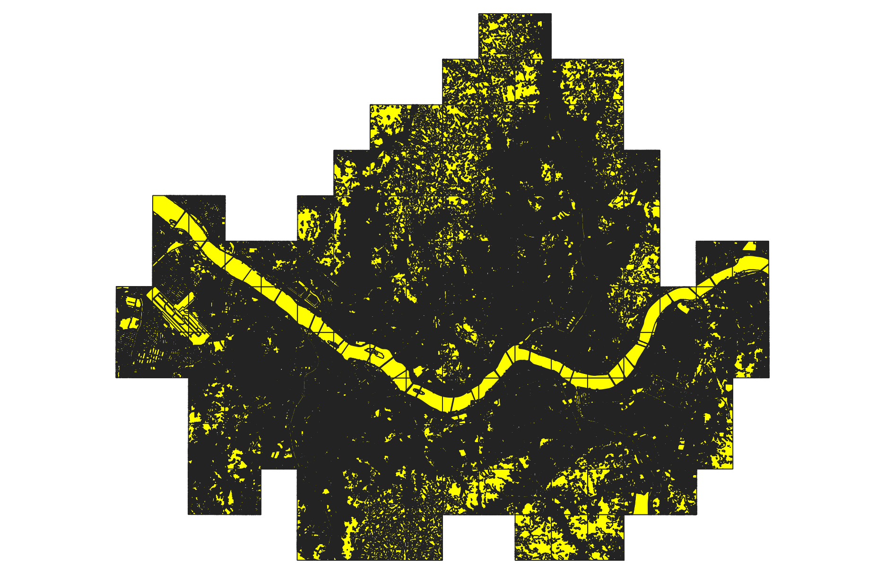

# GreenGap - 녹지 영역 추출 (QGIS 전처리)

## 1. 개요

본 단계에서는 토지피복도 데이터에서 **녹지 영역만 추출**하여
녹지 부족 지역 분석을 위한 기초 데이터를 생성하였다.

---

## 2. 사용 도구 (Tool)

* QGIS (공간 데이터 시각화 및 전처리)
* 데이터 형식: Shapefile (.shp)

---

## 3. 사용 데이터

* 환경공간정보서비스(EGIS) 토지피복도 데이터 (서울시 전체)
* 주요 필드:

  * `L1_CODE` (대분류 코드)
  * `L1_NAME` (대분류 이름)
  * `L2_CODE`, `L2_NAME`
  * `L3_CODE`, `L3_NAME`

---

## 4. 녹지 정의 기준

대분류 기준에서 다음 항목을 녹지로 정의하였다.

* 산림지역
* 초지

※ 자연 기반 녹지 중심 분석을 위해 위 두 항목만 선택

---

## 5. 전처리 방법

### (1) 데이터 로드

* QGIS에 토지피복도 shapefile 로드

---

### (2) 속성 테이블 확인

* `L1_NAME` 필드를 기준으로 분류 값 확인

---

### (3) 녹지 영역 선택 (핵심)

QGIS의 "표현식으로 선택" 기능을 사용하여 녹지 영역 필터링

```sql
"L1_NAME" IN ('산림지역', '초지')
```

---

### (4) 선택 결과 확인

* 지도 상에서 선택된 영역이 **노란색으로 표시**
* 선택된 피처 개수가 0이 아닌지 확인


---

### (5) 선택 영역 저장

* 레이어 우클릭 → Export → Save Selected Features As
* 파일명: `green_area.shp`
* 녹지 영역만 포함된 새로운 레이어 생성

---

## 6. 결과 (시각화)


---

## 7. 결과 해석

* 서울 지역 내 녹지 영역이 공간적으로 분포된 형태 확인 가능
* 산림지역은 외곽에 집중, 초지는 일부 분산된 형태

---

## 8. 정리

본 전처리 단계에서는 서울시 전체 토지피복도 데이터를 기반으로
**녹지 영역만을 정확히 추출하는 작업을 수행**하였다.

해당 결과는 이후:

* 녹지 면적 계산
* 인구 대비 녹지 분석
* 녹지 접근성 분석

등의 핵심 입력 데이터로 활용된다.
