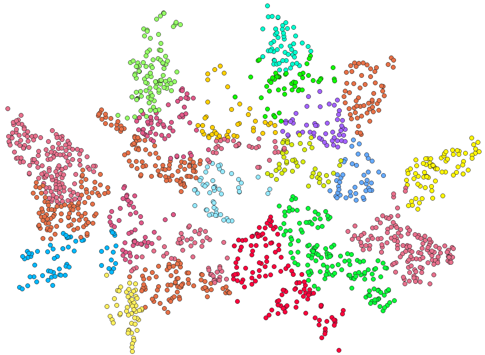
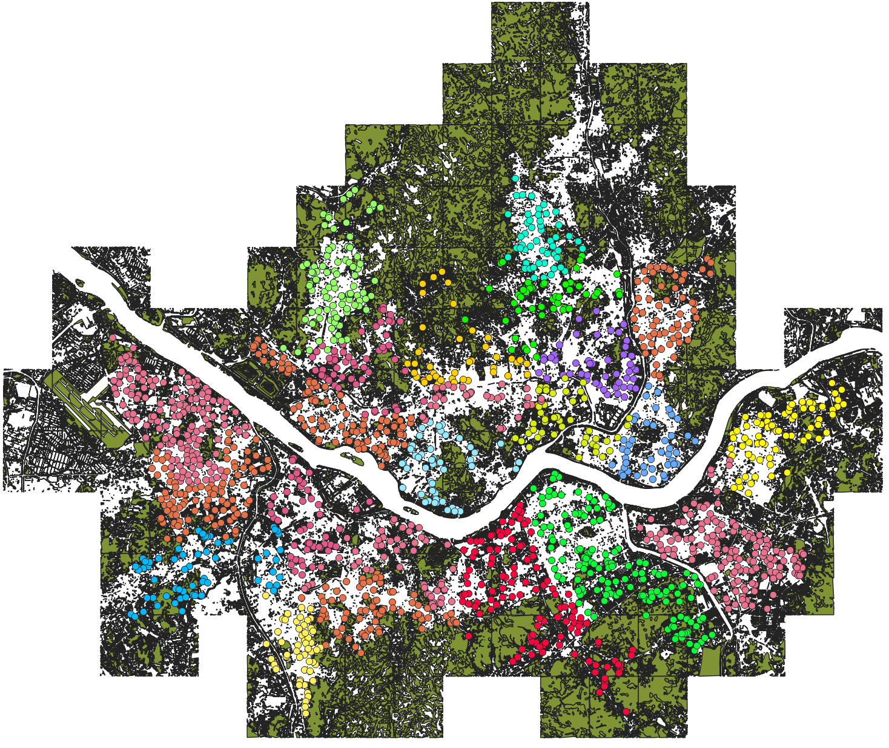

# Data Processing

Raw Data를 분석 가능한 형태로 정제하는 단계.
토지피복도를 격자(행정동 또는 H3) 단위로 분할하고, ML 학습용 데이터셋을 생성한다.

* 사용 도구: QGIS
* 데이터 형식: Shapefile (.shp)

---

## 좌표계 통일

서울시 토지피복도 및 분석에 사용되는 모든 레이어는
정확한 면적 계산을 위해 동일한 좌표계로 통일하였다.

* 사용 좌표계: **EPSG:5179** (KGD2002 / Unified CS)
* 이유:
  * 미터(m) 단위 기반 → 면적 계산 정확
  * 한국 지역 분석에 적합한 투영 좌표계
  * 위경도 좌표계(WGS84) 사용 시 면적 왜곡 발생
* 수행 방법: QGIS → **"Reproject Layer"** 사용
  * 기존 레이어 → EPSG:5179로 변환 후 새로운 레이어 생성

---

## 데이터 정제

공간 분석 과정에서 오류를 방지하기 위해 기하 구조(geometry) 오류를 수정하였다.

* 수행 작업: QGIS → **"Fix Geometries"** 사용
  * self-intersection, invalid polygon 등 오류 자동 보정
* 필요성:
  * Geometry 오류 존재 시 Intersection 실패 발생
  * 공간 분석 결과 오류 발생
* 결과: 모든 레이어를 정상 geometry 상태로 정제

---

## 타일 병합 (Merged)

서울시 토지피복도 데이터는 여러 개의 타일 형태로 제공되므로
전체 분석을 위해 하나의 레이어로 병합하였다.

* 수행 방법: QGIS → **"Merge Vector Layers"** 사용
  * 여러 shapefile을 하나의 레이어로 통합
* 목적:
  * 서울 전체 영역을 하나의 연속된 데이터로 구성
  * 이후 분석(녹지 추출, 격자 생성 등)의 일관성 확보
* 결과: 서울 전체 토지피복도가 하나의 통합 레이어로 생성됨

---
## 녹지 필터링

토지피복도에서 녹지로 분류되는 영역만 추출한다.

### 녹지 정의 기준

대분류(`L1_NAME`) 기준으로 다음 두 항목을 녹지로 정의한다.

* 산림지역
* 초지

※ 자연 기반 녹지 중심 분석을 위해 위 두 항목만 선택

### 처리 절차

#### (1) 데이터 로드

* QGIS에 토지피복도 shapefile 로드

#### (2) 속성 테이블 확인

* `L1_NAME` 필드를 기준으로 분류 값 확인

#### (3) 녹지 영역 선택

QGIS "표현식으로 선택" 기능으로 녹지 영역 필터링

```sql
"L1_NAME" IN ('산림지역', '초지')
```

#### (4) 선택 결과 확인

* 지도 상에서 선택된 영역이 **노란색으로 표시**
* 선택된 피처 개수가 0이 아닌지 확인


#### (5) 선택 영역 저장

* 레이어 우클릭 → Export → Save Selected Features As
* 파일명: `green_area.shp`
* 녹지 영역만 포함된 새로운 레이어 생성

### 결과


* 서울 지역 내 녹지 영역이 공간적으로 분포된 형태 확인 가능
* 산림지역은 외곽에 집중, 초지는 일부 분산된 형태

### 출력

`green_area.shp` — 이후 Feature Engineering 단계의 입력 데이터로 활용

---

## 공원 데이터 추출

서울시 25개 자치구의 공원 데이터를 구별 CSV 파일에서 분석에 필요한 컬럼만 추출하였다.

* 사용 도구: Python (pandas)
* 입력 데이터: `data/구/OO구.csv` (25개 파일)
* 출력 데이터: `output/OO구ver2.csv` (25개 파일)

### 추출 컬럼

| 컬럼명 | 설명 |
|--------|------|
| `공원명` | 공원 이름 |
| `공원구분` | 공원 유형 (근린공원, 소공원 등) |
| `소재지지번주소` | 공원 소재지 주소 |
| `위도` | 공원 중심 위도 |
| `경도` | 공원 중심 경도 |
| `공원면적` | 공원 면적 (㎡) |
| `데이터기준일자` | 데이터 최신화 기준일 |

### 처리 결과

| 자치구 | 공원 수 |
|--------|---------|
| 강남구 | 146 |
| 강동구 | 74 |
| 강북구 | 54 |
| 강서구 | 151 |
| 관악구 | 75 |
| 광진구 | 43 |
| 구로구 | 62 |
| 금천구 | 52 |
| 동대문구 | 50 |
| 동작구 | 52 |
| 마포구 | 90 |
| 서대문구 | 67 |
| 서초구 | 128 |
| 성동구 | 48 |
| 성북구 | 53 |
| 송파구 | 140 |
| 양천구 | 96 |
| 영등포구 | 50 |
| 용산구 | 49 |
| 은평구 | 105 |
| 종로구 | 43 |
| 중구 | 38 |
| 중랑구 | 58 |

### QGIS 레이어 시각화





### 출력

`output/OO구ver2.csv` — 이후 공원 접근성 계산의 입력 데이터로 활용
