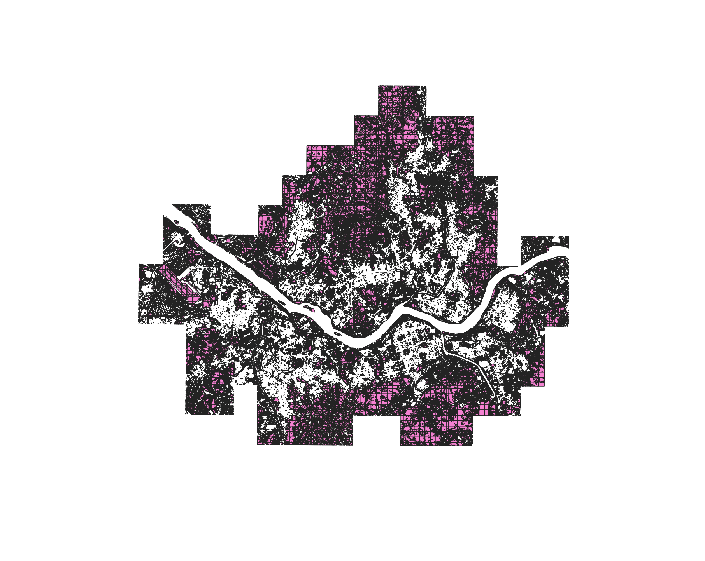
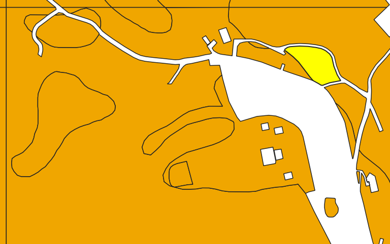

# Feature Engineering

Data Processing 결과를 바탕으로 분석에 필요한 지표를 계산하는 단계.
도시공원 및 녹지법 기준 **1인당 공원녹지 6m²/인** 을 적용하여 녹지 부족 여부를 판단한다.

---

## 녹지 면적 계산

녹지 부족 분석을 위해 각 격자 단위별 녹지 면적을 계산하였다.
토지피복도 기반 녹지 레이어와 생성한 grid를 결합하여
격자별 녹지 면적을 정량적으로 산출하였다.

### (1) 분석용 레이어 구성

| 레이어 | 설명 |
|--------|------|
| `greenarea` | 토지피복도에서 산림지역, 초지만 추출한 녹지 레이어 |
| `grid` | 서울 전체 영역을 500m × 500m으로 분할한 격자 레이어 |

---

### (2) Intersection 수행

격자별 녹지 면적 계산을 위해 grid와 녹지 레이어를 공간적으로 분할하였다.

* QGIS → Vector overlay → **Intersection**
* 결과 레이어: `intersection`
* 의미:
  * 각 grid 셀 내부에 존재하는 녹지 영역만 추출됨
  * 하나의 grid 셀이 여러 개의 녹지 조각으로 나뉘어 생성됨

<!-- 이미지 첨부: Intersection 결과 레이어 시각화 -->

---

### (3) 녹지 면적 계산 (`$area`)

Intersection 결과 레이어에서 각 녹지 조각의 면적을 계산하였다.

* 필드 계산기 사용: `$area`
* 결과:
  * 각 feature = "격자 내부의 녹지 조각 1개"
  * 해당 feature의 실제 면적(m²) 계산됨

<!-- 이미지 첨부: 필드 계산기 $area 적용 화면 -->

---

### (4) 격자별 녹지 면적 합산

하나의 grid 셀 안에 여러 개의 녹지 조각이 존재하므로
이를 합산하여 격자 단위 녹지 총 면적을 계산하였다.

* QGIS → **Join attributes by location (summary)**
* 설정:

  | 항목 | 값 |
  |------|----|
  | Join to features | `grid` |
  | By comparing to | `intersection` |
  | Spatial condition | intersect |
  | Field | `area` |
  | Summary | sum |

---

### (5) 결과 레이어

* 결과 레이어: `Joined_layer`
* 주요 필드:

  | 필드 | 설명 |
  |------|------|
  | `area_sum` | 해당 grid 셀 내 녹지 총 면적 (m²) |

<!-- 이미지 첨부: Joined_layer 속성 테이블 또는 지도 시각화 -->

---

### (6) NULL 값의 의미

| 값 | 의미 |
|----|------|
| `area_sum = NULL` | 해당 grid 셀 내부에 녹지가 전혀 없음 |
| `area_sum > 0` | 녹지가 존재하며, 값은 면적(m²) |

---

### (7) 정리

본 과정에서는 토지피복도 기반 녹지 데이터를 격자 단위로 분할하고 면적을 계산하여
각 grid 셀마다 **녹지 면적 존재 여부**와 **녹지 총 면적**을 정량적으로 산출하였다.

이 결과는 이후:

* 1인당 녹지 면적 계산
* 녹지 부족 지역 판단

을 위한 핵심 지표로 활용된다.

---

## 녹지 비율 계산

<!-- 추후 작성 -->

---

## 공원 접근성 계산

2040 서울도시기본계획 기준: 보행 10분(약 800m) 이내 공원 접근권 확보 여부를 거리 연산으로 산출한다.

<!-- 추후 작성 -->

---

## 1인당 녹지 계산

법적 기준: 1인당 공원녹지 **6m²/인**

<!-- 추후 작성 -->
